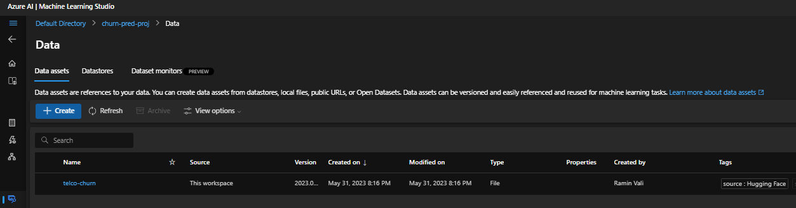
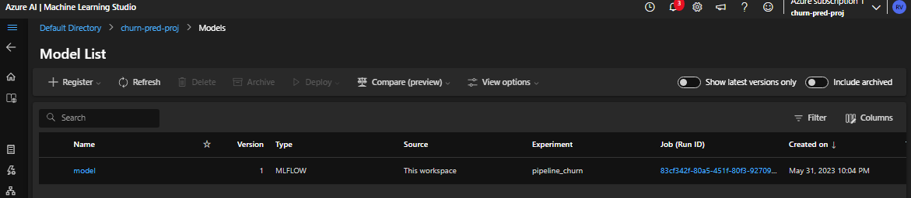

# Telecommunication Company Customer Churn Prediction
This project presents an end to end machine learning task. All the stages of a normal machine learning life cycle have been preformed and presented. The aim of the project is to develop a prediction model for telecommunication company (telco) customer churn and put this into production using [Azure ML](https://learn.microsoft.com/en-us/azure/machine-learning/?view=azureml-api-2). 

## Motivation
The Global Telecommunication [market](https://www.skyquestt.com/report/telecommunication-market#:~:text=Global%20Telecommunication%20Market%20size%20was,a%20set%20of%20communication%20instruments.) size was valued at USD 1700.2 billion in 2021 and is poised to grow from USD 1805.61 billion in 2022 to USD 3102.74 billion by 2030. Given how large and competitive this industry is, the telcos have a vested interest in retaining their customer base, as acquiring new customers is costly. 

Therefore, the goal of predicting if a customer will move to a competitor (churn) is motivated. If the telco can get to the customers who are on the verge of churning before they in fact churn, they can offer incentive for the customer to stay. The churn can be predicted using the customer data and machine learning techniques. 

## Data Source
The telco customer churn data is originally from [IBM Business Analytics](https://community.ibm.com/community/user/businessanalytics/blogs/steven-macko/2019/07/11/telco-customer-churn-1113) and the data for the project is retrieved from [Hugging Face](https://huggingface.co/datasets/scikit-learn/churn-prediction). A copy can be retrieved under the data folder.

## Repository Contents
- [requirements.txt](requirements.txt): The packages required to run the EDA.

- [EDA.ipynb](EDA.ipynb): The explotary data analysis is presented in the EDA notebook. It involves all the standard procedure for data exploration, cleaning, feature engineering and feature extraction.

- [Production.ipynb](Production.ipynb): This notebook works through the whole production phase and includes the following steps:
    - Connecting to the workspace
    - Creating the data asset
    - Creating a compute cluster   
    - Creating the custom pipeline environment
    - Creating pipeline components with [Python SDK V2](https://learn.microsoft.com/en-us/azure/machine-learning/concept-v2?view=azureml-api-2#azure-machine-learning-python-sdk-v2)    
    - Loading and executing the pipeline
    - Registering the model
    - Creating an online endpoint
    - Endpoint deployment                    

- [sample_data.json](sample_data.json): input to test the online deployment.

- [setup.sh](setup.sh): shell file to provision the resource group and workspace for the project using the Azure CLI. This file has to be run in Azure portal cloud shell first. 

# EDA Setup
The environment requirements are included in  [requirements.txt](requirements.txt); as such, they can be installed in an environment and used to run the EDA notebook.

# Production Setup

## Pre-requisites
You will need a Azure subscription for this. Once you have that you can follow to the next step.

## Provision Workspace and Compute resources
Go to Azure [portal](https://portal.azure.com/#home), cloud shell, open bash and
type the following in the terminal (or use shift + insert to paste)
``` 
rm -r Customer_Churn -f
git clone https://github.com/RaminVali/Customer_Churn
```

After the repository has been cloned, enter the following commands
```
cd Customer_Churn
chmod +x setup.sh
./setup.sh
```
 The  ```setup.sh``` will create the workspace, resource group and the compute instance required to run the project for production. 

Wait for the script to complete - this typically takes around 5-10 minutes. Once the the shell script has finished executing, we will have a resource group called ```rg-churn-pred-proj``` and a workspace called ```churn-pred-proj```. There will also be a computing instance set up that we wil use to run the production notebook on.


## Clone the repository into the Azure ML Studio
In the Azure portal, navigate to the Azure Machine Learning workspace named ```customer_churn_proj```.

Select the Azure Machine Learning workspace just created, and in its overview page, select Launch studio.

Another tab will open in your browser to open the Azure Machine Learning studio. Close any pop-ups that appear in the studio.

Within the Azure Machine Learning studio, navigate to the Compute page and verify that the compute instance and cluster you created in the previous section exist. The compute instance should be up and running. 

In the compute instances tab, find your compute instance, and select the Terminal application.

In the terminal, install the Python SDK on the compute instance by running the following command: 

```
 pip install azure-ai-ml
 ```

- Run the following command to clone the Git repository containing notebooks, data, and other files to your workspace: 

```
git clone https://github.com/RaminVali/Customer_Churn
```
Once clones open the [Production.ipynb](Production.ipynb) notebook in the compute instance created 

To do this, refresh the file explorer pane and click on Production.ipynb and open it. Please select Python 3.10 - SDK v2 and run the cells in the same order as presented, noting the steps that require for you to wait while environments/compute clusters etc, are spun. 

# Production Discussion:
This section presents the guide to various project steps whilst run through the notebook and the screen shots for the appropriate outputs you should be getting at each stage.

You will need to add your subscription ID in the appropriate place in the second cell. This is obtainable from the portal page.

Beginning with the data, it is best to register it as an asset. Once the data is registered as an asset in the workspace, it will appear under the data tab.

## Creating a data asset
Once the data asset is created you can check it under the data tab.


## Compute cluster for pipeline
We will run the project on a cpu cluster compute resource that we define. This can be viewed under the compute clusters in the compute section.

 

## Pipeline job environment creation
We need to define a custom environment for our production pipeline. There are various ways to do this, in this instance we will use conda and a yaml file to define our environment and submit it as a job to be created. Once it is created it can be be viewed under the environments tab.


## Building the pipeline
Pipelines are the backbones of the production ready code. They are flexible and scalable workflow structures that can be tracked, put into production, and scheduled for the future repeats as well. 

The pipeline used in this project has two components. The first is the prep-data where data cleaning, preprocessing, feature extraction and encoding are performed. 

The second component is the train-model, where training and evaluation is performed and various artifacts and figures are logged for future use, through [MLflow](https://mlflow.org/).

Each of the components has a yaml file defining the inputs and outs, environment to be used and other metadata. Once the pipeline has finished executing, we will have the following:

 
The model will be in the mnt directory. There is an MLflow tracking server [open bug](https://github.com/mlflow/mlflow/issues/3536) that stops the model appearing on the local folder.

The pipeline job gives us the following artifacts:


## Register the Model
Now that we have the model as an output for the job, we can register it using MLflow, the artifact path and run id. These are all obtainable form the MLmodel file. 



## Define and create an endpoint
Now we begin preparing the endpoint to perform inference using our model. We first create an online endpoint. This is done visa the Python SDK V2. Once the endpoint is created, it will appear under the endpoints tab:


## Configure endpoint and deploy model to the endpoint

Once the endpoint is successfully created, then it has to be configured to use the appropriate compute. Once these are in place, we can deploy the model to the newly created online endpoint. Once the model is successfully deployed, we have to update it as it takes 0% of the incoming traffic by default. We update the deployment so that it takes 100% of the traffic.


## Testing the deployment (Moment of Truth!)
We use the sample_data.json file we have in the directory and we will feed it to the endpoint and print the response.


Remember to delete the endpoint and the resource group from azure after finishing the project. Otherwise you will incur charges.

The End
